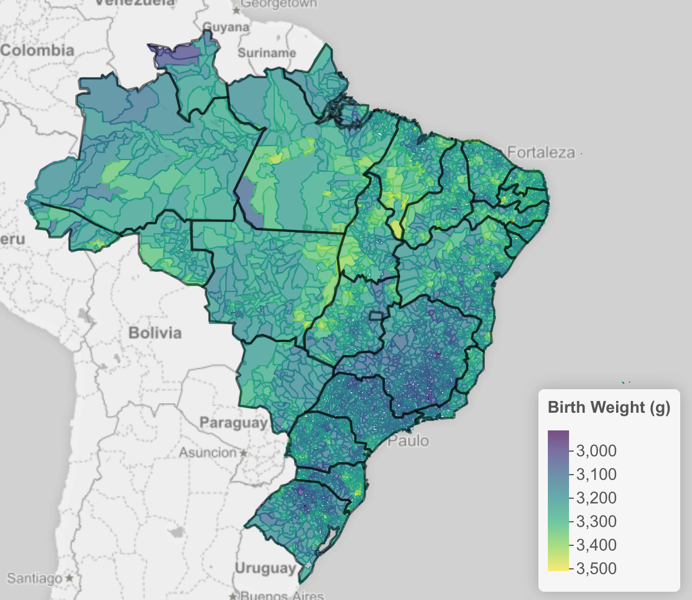

```{r knitr_init, echo=FALSE, warning=FALSE, message=FALSE, results="asis"}
library(knitr)
library(rmdformats)
library(dplyr)

## Global options
options(max.print = "75")
opts_chunk$set(
  echo = FALSE,
  # cache = TRUE,
  prompt = FALSE,
  tidy = FALSE,
  comment = NA,
  message = FALSE,
  warning = FALSE)
opts_knit$set(width = 75)

load("../data/artifacts/brthwt_summaries.Rdata")
load("../data/artifacts/state_summaries.Rdata")
load("../data/artifacts/muni_summaries.Rdata")
load("../data/artifacts/muni_census_ga.Rdata")
load("../data/artifacts/vrbls.Rdata")
load("../data/artifacts/census_rendabr.Rdata")
load("../data/geo/state_muni_shapefiles.Rdata")
```

# Introduction

This document provides an overview and some exploratory plots of the [Brazil Live Births "Sistema de Informações sobre Nascidos Vivos" (SINASC) data](http://svs.aids.gov.br/cgiae/sinasc/) and the Brazil Census data, both available from [Datasus](http://datasus.saude.gov.br). According to the website, SINASC "was officially deployed in 1990 with the objective of collecting data on births throughout the country and providing birth data for all levels of the Health System."

The SINASC data is publicly available to download from the [datasus ftp site](ftp://ftp.datasus.gov.br/dissemin/publicos/SINASC/NOV/DNRES). For the results shown in this document, data was downloaded for births from 2001 to 2015, resulting in 44.5 million birth records. The final section of this document will go into more detail about how the data was processed and the variables that are available in the data.

Given the quality, completeness, and size of this data, there are many research questions that could potentially be studied using it. Ultimately, we will be trying to understand the risk factors for low birth weight, but document mostly contains some introductory exploratory visualizations to help illustrate what is in the data.

# SINASC Exploration

In this document, we will look at some visualizations of the variables in the data ranging from summaries at the population level, the state level, and the municipality level.

## Population Summaries

### Yearly Births

```{r echo=FALSE, warning=FALSE, message=FALSE, fig.height=4}
yearly_births <- daily_births %>%
  group_by(birth_year) %>%
  summarise(n = sum(n))

ggplot(yearly_births, aes(birth_year, n / 1e6)) +
  geom_point() +
  theme_bw() +
  labs(x = "Birth Year", y = "Number of Births (millions)")
```

The annual number of births is around 3 million, having dipped down to under 2.9 million and rebounding in 2014.

### Daily Births

```{r echo=FALSE, warning=FALSE, message=FALSE, fig.width=10}
daily_births <- daily_births %>%
  mutate(
    birth_month = as.integer(format(birth_date, "%m")),
    birth_month2 = factor(month.abb[birth_month], levels = month.abb),
    birth_wkday = format(birth_date, "%a"),
    day_type = ifelse(birth_wkday %in% c("Sat", "Sun"), "weekend", "weekday"))

ggplot(daily_births, aes(birth_date, n, color = day_type)) +
  geom_point(alpha = 0.7) +
  theme_bw() +
  scale_color_tableau("tableau10", NULL) +
  scale_x_date(labels = function(x) paste0("'", substr(x, 3, 4))) +
  facet_wrap(~ birth_month2, nrow = 1) +
  labs(x = "Birth Date", y = "Number of Daily Births")
```

This plot shows the number of daily births broken down by birth month and colored according to whether the birth was on a weekend or weekday. Breaking things up in this way helps highlight some interesting phenomena.

First, we can see that there is a clear annual cycle for births, with the most popular months being March, April, and May. Also, we see that there are significantly more births on weekdays vs. weekends.

How can the number of births vary so much over different temporal breakdowns? The weekday/weekend phenomenon is easier to try to explain, and this has to do with the fact that a large proportion of births in Brazil are scheduled cesareans (as we'll see below), and doctors will most likely schedule these for weekdays rather than weekends.

### Yearly Births by Delivery Type

```{r echo=FALSE, warning=FALSE, message=FALSE, fig.height=5}
yearly_births_deliv <- daily_births_deliv %>%
  group_by(birth_year, deliv_type) %>%
  summarise(n = sum(n)) %>%
  group_by(birth_year)

yearly_births_deliv <- yearly_births_deliv %>%
  filter(!is.na(deliv_type)) %>%
  group_by(birth_year) %>%
  mutate(
    n_year = sum(n),
    pct = n / n_year * 100)

ggplot(yearly_births_deliv, aes(birth_year, n / 1000000, color = deliv_type)) +
  geom_point(size = 2.5, alpha = 0.75) +
  theme_bw() +
  scale_color_tableau(name = "Delivery") +
  labs(x = "Year", y = "Number of Births (millions)")
```

The only two categories for delivery type are vaginal and cesarean. As can be seen, cesarean births have become dramatically more prevalent than vaginal births, with the inflection point in 2009.

Another way to look at this is as the two delivery types being presented as percentages of births over time.

```{r echo=FALSE, warning=FALSE, message=FALSE, fig.height=5}
ggplot(yearly_births_deliv, aes(birth_year, pct, fill = deliv_type)) +
  geom_col(position = position_stack()) +
  geom_abline(slope = 0, intercept = 50, alpha = 0.5) +
  theme_bw() +
  scale_fill_tableau("tableau10", "Delivery Type") +
  labs(x = "Year", y = "Percentage of Births")
```

### Birth Weight vs. Year

This plot and all of the following summary plots examine the relationship between birth weight and other variables in the data. The dots represent the median birth weight value and the lines extend from the dots to the first and third quartiles, such that the span of the line represents the middle 50% of observations in the data to give an indication of variability.

```{r echo=FALSE}
p <- plot_var_by(brthwt_yearly, "Birth Weight (g)", "birth_year", xlab = "Birth Year")
p + geom_abline(slope = 0, intercept = 2500, linetype = 2, alpha = 0.7)
```

This plot shows, as aggregated across the entire country, that the distribution of birth weight has not changed over time.

### Birth Weight vs. Gestational Age at Birth

```{r echo=FALSE}
p <- plot_var_by(brthwt_gest_weeks, "Birth Weight (g)", "gest_weeks",
  xlab = "Gestational Age at Birth")
p + geom_abline(slope = 0, intercept = 2500, linetype = 2, alpha = 0.7)
```

As we would expect to see, pre-term birth is strongly associated with birth weight. The horizontal dashed line at 2500 grams indicates the threshold for low birth weight.

### Birth Weight vs. Pregnancy Type

```{r echo=FALSE}
## *** preg_type
p <- plot_var_by(brthwt_preg_type, "Birth Weight (g)", "preg_type",
  xlab = "Pregnancy Type")
p + geom_abline(slope = 0, intercept = 2500, linetype = 2, alpha = 0.7)
```

Carrying more than one child has an obvious association with birth weight.

### Birth Weight vs. Delivery Type

```{r echo=FALSE}
## *** deliv_type
p <- plot_var_by(brthwt_deliv_type, "Birth Weight (g)", "deliv_type",
  xlab = "Delivery Type")
p + geom_abline(slope = 0, intercept = 2500, linetype = 2, alpha = 0.7)
```

### Birth Weight vs. Sex

```{r echo=FALSE}
## *** sex
p <- plot_var_by(brthwt_sex, "Birth Weight (g)", "sex")
p + geom_abline(slope = 0, intercept = 2500, linetype = 2, alpha = 0.7)
```

### Birth Weight vs. Race

```{r echo=FALSE}
## *** race
p <- plot_var_by(brthwt_race, "Birth Weight (g)", "race")
p + geom_abline(slope = 0, intercept = 2500, linetype = 2, alpha = 0.7)
```

### Birth Weight vs. Mother's Education

```{r echo=FALSE}
## *** m_educ
p <- plot_var_by(brthwt_m_educ, "Birth Weight (g)", "m_educ",
  xlab = "Mother's Education")
p + geom_abline(slope = 0, intercept = 2500, linetype = 2, alpha = 0.7)
```

### Birth Weight vs. Marital Status

```{r echo=FALSE}
## *** marital status
p <- plot_var_by(brthwt_marital_status, "Birth Weight (g)", "marital_status",
  xlab = "Marital Status")
p + geom_abline(slope = 0, intercept = 2500, linetype = 2, alpha = 0.7)
```

### Birth Weight vs. Mother's Age

```{r echo=FALSE}
## *** mother's age
p <- plot_var_by(brthwt_m_age_yrs, "Birth Weight (g)", "m_age_yrs",
  xlab = "Mother's Age")
p + geom_abline(slope = 0, intercept = 2500, linetype = 2, alpha = 0.7)
```

There is an interesting association between the mother's age and birth weight. This plot is also interesting in that it shows that the span of a childbearing mother's age is quite large.

### Birth Weight vs. Number of Prenatal Visits

```{r echo=FALSE}
## *** number of prenatal visits
p <- plot_var_by(brthwt_n_prenatal_visit, "Birth Weight (g)", "n_prenatal_visit",
  xlab = "Number of Prenatal Visits")
p + geom_abline(slope = 0, intercept = 2500, linetype = 2, alpha = 0.7)
```

Although not extremely strong, there is an indication that there is some association between higher birth weights and number of prenatal visits.

## By State

The previous plots looked at the data as a whole population. It is interesting to look on a geographical level to see how the variables vary across geography and time. In this section we will look at the geographical granularity of the 27 states of Brazil.

Most of the plots in this section show the states represented as a regular grid, with the grid laid out in a way as to mirror the geography as closely as possible.

### Percent Change in Births Over Time

```{r echo=FALSE, warning=FALSE, message=FALSE, fig.height=7}
birth_year_state2 <- birth_year_state %>%
  arrange(m_state_code, birth_year) %>%
  group_by(m_state_code) %>%
  mutate(pct_chg = 100 * (n - n[1]) / n[1]) %>%
  filter(!is.na(m_state_code))

birth_col <- birth_year_state2 %>%
  group_by(m_state_code) %>%
  summarise(val = tail(pct_chg, 1))

ggplot(birth_year_state2, aes(birth_year, pct_chg)) +
  geom_rect(data = birth_col, aes(fill = val),
    xmin = -Inf, ymin = -Inf, xmax = Inf, ymax = Inf, alpha = 0.5,
    inherit.aes = FALSE) +
  geom_point() +
  geom_abline(slope = 0, intercept = 0, alpha = 0.25) +
  theme_bw() +
  scale_fill_gradient2("% Change\n2001 - 2015") +
  scale_x_continuous(labels = function(x) paste0("'", substr(x, 3, 4))) +
  # scale_fill_viridis_c("% Change 2015") +
  facet_geo(~ m_state_code, grid = "br_states_grid2", label = "name") +
  theme(strip.text.x = element_text(margin = margin(0.1, 0, 0.1, 0, "cm"), size = 7)) +
  labs(x = "Birth Year", y = "Percentage Change in Number of Births")
```

This plot shows the percentage change in number of births over time and by state, using the number of births in 2001 as the baseline for the percent change calculation. For example, in Alagoas, there were 20% fewer births in 2015 as in 2001, whereas in Espírito Santo, the number of births in 2015 has not changed from that in 2001, although the percentage dipped in the middle.

Each panel of the display is colored according to the 2015 percent change value to help draw attention to states that have had a net increase or decrease in number of births. This plot does not take population into account.

### Percentage of Children Born With Low Birthweight

```{r echo=FALSE, warning=FALSE, message=FALSE, fig.height=7}
brthwt_col <- brthwt_year_state %>%
  group_by(m_state_code) %>%
  summarise(val = tail(pct_low, 1))

ggplot(brthwt_year_state, aes(birth_year, pct_low)) +
  geom_rect(data = brthwt_col, aes(fill = val),
    xmin = -Inf, ymin = -Inf, xmax = Inf, ymax = Inf, alpha = 0.5, inherit.aes = FALSE) +
  geom_point() +
  theme_bw() +
  viridis::scale_fill_viridis("% Low\nBirthweight\n(2015)") +
  scale_x_continuous(labels = function(x) paste0("'", substr(x, 3, 4))) +
  facet_geo(~ m_state_code, grid = "br_states_grid2", label = "name") +
  theme(strip.text.x = element_text(margin = margin(0.1, 0, 0.1, 0, "cm"), size = 7)) +
  labs(x = "Birth Year", y = "Percentage of Children Born with Low Birthweight")
```

This plot shows the yearly percentage of children born with low birth weight for each state. While we saw earlier that the overall distribution of birth weight for the entire population does not change over time, when looking at percentage of low birth weight children over time by state, We see that this statistic is not necessarily constant over time.

The overall range of percentage of low birth weight children spans from 5 to 10%. The panels of the display are colored based on the 2015 low birth weight percentage to help draw attention regions where this percentage is higher or lower than others. In general the states in the southern half of the country have a higher prevalence of low birth weight than those in the northern half.

Some states are showing an increasing rate of low birth weight births. For example, Ceará saw the largest 2001-2015 increase of 1.6%.

### Distributon of Delivery Type

```{r echo=FALSE, warning=FALSE, message=FALSE, fig.height=7}
plot_st_yr(births_st_dlv_y, "deliv_type", llab = "Delivery Type")
```

This plot shows the breakdown of delivery type as a percentage of births each year by state. From this plot is is clear that cesarean birth is increasing in all states, but it is more prevalent in some states than others. For example, many states in the northwest still have vaginal births as the majority.

### Distribution of Mother's Education

```{r echo=FALSE, warning=FALSE, message=FALSE, fig.height=7}
plot_st_yr(births_st_edu_y, "m_educ", llab = "Mother's\nEducation")
```

This plot shows the education of mothers giving birth has been improving over time across all states.

### Distributon of Race

```{r echo=FALSE, warning=FALSE, message=FALSE, fig.height=7}
plot_st_yr(births_st_race_y, "race", llab = "Race")
```

This plot shows the distribution of race of the children born over time and by state. From this we see that across nearly all states, the multiracial share of the population is growing relative to the other groups. We also see that the southern states have children being born that are predominantly white, and that a only few states (in the northwest) have a significant population of indigenous children being born.

### Distribution of Marital Status

```{r echo=FALSE, warning=FALSE, message=FALSE, fig.height=7}
plot_st_yr(births_st_mar_y, "marital_status", llab = "Marital Status")
```

From this we can observe that single mothers giving birth is more common than other marital status and is on the rise across all states. In a couple of states like Minas Gerais and Espírito Santo, the comparison of single / married proportion is nearly equal, while in most other states, single mothers are more prevalent.

### Distribution of Prenatal Visits

```{r echo=FALSE, warning=FALSE, message=FALSE, fig.height=7}
plot_st_yr(births_st_vst_y, "n_prenatal_visit", llab = "# Prenatal\nVisits")
```

This plot shows mothers in the southern states are typically having more prenatal visits than those in the north.

### Distribution of Binned Mother's Age

```{r echo=FALSE, warning=FALSE, message=FALSE, fig.height=7}
plot_st_yr(births_st_mage_y, "m_age_bin", llab = "Mother's Age")
```

Here we have binned the mother's age into teens, twenties, thirties, and forties+. We see the general trend of mothers having babies at a later age over time, with some states such as São Paulo and the Federal District having nearly half of births coming from women aged 30 or older in 2015.

### Median Mother's Age

```{r echo=FALSE, warning=FALSE, message=FALSE, fig.height=7}
ggplot(births_st_mage_y2, aes(birth_year, med)) + # , ymin = q1, ymax = q3)) +
  geom_point(size = 2) +
  theme_bw() +
  # geom_errorbar(width = 0.2) +
  facet_geo(~ m_state_code, grid = "br_states_grid2", label = "name") +
  theme(strip.text.x = element_text(margin = margin(0.1, 0, 0.1, 0, "cm"), size = 7)) +
  labs(x = "Birth Year", y = "Median Mother's Age")
```

This shows the median yearly mother's age for each state. Clearly mother's age has been increasing over time everywhere, but many of the northern states have a lower median mother's age.

## By Municipality

There are over 5500 municipalities, so there will be many possible way to look at the data at the municipality level.

### Mean Birth Weight by Municipality

To start, below is a plot of of the mean birth weight for each municipality plotted by rank within each region of Brazil.

```{r echo=FALSE}
ggplot(brthwt_muni_region, aes(rank, mean_bwt, color = region_code)) +
  geom_point() +
  geom_smooth(method = "lm", formula = y ~ 1, se = FALSE) +
  theme_bw() +
  scale_color_tableau(guide = FALSE) +
  coord_flip() +
  facet_wrap(~ region_code, scales = "free_y", ncol = 1, strip.position = "left") +
  labs(y = "Mean Birthweight", x = "Municipality Rank (within region)")
```

For reference, below is a map with these regions indicated in the same colors.

```{r echo=FALSE}
library(leaflet)

Sys.setenv(MAPBOX_TOKEN = "pk.eyJ1IjoicmhhZmVuIiwiYSI6ImNpdnY5M25oaDAwc24yb281cnFoY3g2YTYifQ.aSlJqMyxuFCtaP6euwu-QA")

pal <- colorFactor(palette = scale_color_tableau()$palette(5),
  levels = levels(brthwt_muni_region$region_code))
labels <- sprintf(
  "<strong>Region: %s</strong><br/>State: %s",
  br_shp$REGIAO, br_shp$ESTADO
) %>% lapply(htmltools::HTML)

leaflet(br_shp) %>%
  setView(
    sum(range(sp::coordinates(br_shp)[, 1])) / 2,
    sum(range(sp::coordinates(br_shp)[, 2])) / 2,
    4) %>%
  addProviderTiles("MapBox", options = providerTileOptions(
    id = "mapbox.light",
    accessToken = Sys.getenv('MAPBOX_TOKEN'))) %>%
  addPolygons(
    fillColor = ~pal(REGIAO),
    weight = 1,
    opacity = 1,
    color = ~pal(REGIAO),
    fillOpacity = 0.7,
    highlight = highlightOptions(
      weight = 2,
      color = "#666",
      fillOpacity = 0.7,
      bringToFront = TRUE),
    label = labels,
    labelOptions = labelOptions(
      style = list("font-weight" = "normal", padding = "3px 8px"),
      textsize = "15px",
      direction = "auto")) %>%
  addLegend(pal = pal, values = ~REGIAO, opacity = 0.7, title = "Region",
    position = "bottomright")
```

### Choropleth of Mean Birth Weight

Below is a screenshot of an interactive choropleth map that shows the average birth weight for each municipality.



The interactive map is large and takes a while to load, which is the reason for showing a screenshot here. To interact with the map, follow [this link](maps/muni_brthwt.html). There, you will be able to pan and zoom and hover to get more information about each municipality.

More to come soon.

# Census Exploration

There are several census datasets (see census data preparation section below), but we will focus on the "RENDABR" dataset, which provides data for the average household income per capita at the municipality level.

Variables in this dataset include:

- `muni_code`: Municipality code
- `year`: Year of the data
- `race`: color / race
- `house_inc`: sum of the average household income (numerator)
- `pop`: population considered (denominator)
- `n_child`: number of children considered
- `pop_2mw`: population with average household income per capita less than 1/2 minimum wage
- `pop_4mw`: population with average household income per capita less than 1/4 minimum wage
- `n_child_2mw`: children in a situation of average household income per capita less than 1/2 minimum wage
- `n_child_4mw`: children in a situation of average household income per capita less than 1/4 minimum wage
- `pop_16unemp`: resident economically active population aged 16 and over who are unemployed
- `pop_16`: resident economically active population aged 16 and over
- `pop_10work`: resident population with 10 to 15 years of age who is working or looking for work
- `pop_10`: total resident population with 10 to 15 years of age

The census data is recorded for 1991, 2000, and 2010. For each municipality and race, numbers are provided that can use to construct statistics (means and proportions) at different levels of aggregation.

## Population Summaries

### 2010 distribution of income less than 1/4 minimum wage by race

```{r echo=FALSE, warning=FALSE, message=FALSE, fig.height=5}
by_race <- rendabr %>%
  filter(year == 2010) %>%
  group_by(race) %>%
  summarise(
    mean_inc = sum(house_inc) / sum(pop),
    prop_4mw = sum(pop_4mw) / sum(pop),
    pop = sum(pop)) %>%
  ungroup() %>%
  mutate(
    race_p = fct_reorder(race, prop_4mw),
    race_mi = fct_reorder(race, mean_inc))

ggplot(by_race, aes(race, prop_4mw * 100, fill = race)) +
  geom_col() +
  theme_bw() +
  scale_fill_tableau(guide = FALSE) +
  labs(
    y = "Proportion with household income less than 1/4 minimum wage",
    x = "Race")
```

### 2010 distribution of average monthly household income by race

```{r echo=FALSE, warning=FALSE, message=FALSE, fig.height=5}
ggplot(by_race, aes(race, mean_inc, fill = race)) +
  geom_col() +
  theme_bw() +
  scale_fill_tableau(guide = FALSE) +
  labs(y = "Average household income (R$)", x = "Race")
```

There are many other variables and other census datasets to add visualizations for here as well.

## By State

### 2010 average income by state

```{r echo=FALSE, warning=FALSE, message=FALSE, fig.height=7}
state_inc <- rendabr %>%
  group_by(state_code, year) %>%
  summarise(
    mean_inc = sum(house_inc) / sum(pop),
    prop_4mw = sum(pop_4mw) / sum(pop),
    pop = sum(pop)) %>%
  left_join(state_codes) %>%
  ungroup() %>%
  mutate(state_name = fct_reorder(state_name, mean_inc))

state_inc10 <- state_inc %>%
  filter(year == 2010) %>%
  mutate(
    state_name = fct_reorder(state_name, mean_inc),
    region_name = fct_reorder(region_name, mean_inc, .desc = TRUE))

state_inc10p <- state_inc %>%
  filter(year == 2010) %>%
  mutate(
    state_name = fct_reorder(state_name, prop_4mw, .desc = TRUE),
    region_name = fct_reorder(region_name, prop_4mw))

ggplot(state_inc10, aes(mean_inc, state_name, color = region_name)) +
  geom_point(size = 2) +
  facet_grid(region_name ~ ., scales = "free_y", space = "free_y") +
  theme_bw() +
  scale_color_tableau(guide = FALSE) +
  expand_limits(x = 0) +
  labs(y = NULL, x = "Average monthly household income (R$)")
```

Here we see that the southern states are the most wealthy, and the northern states having mostly average incomes less than R$ 500. The federal district really stands out, having an average income that is almost double that of most other states.

Note that since only sums and counts are reported, we do not have enough information to compute standard deviations when we do these aggregations.

### 2010 proportion of households with income less than 1/4 minimum wage by state

```{r echo=FALSE, warning=FALSE, message=FALSE, fig.height=7}
ggplot(state_inc10p, aes(prop_4mw * 100, state_name, color = region_name)) +
  geom_point(size = 2) +
  facet_grid(region_name ~ ., scales = "free_y", space = "free_y") +
  theme_bw() +
  scale_color_tableau(guide = FALSE) +
  expand_limits(x = 0) +
  labs(
    y = NULL,
    x = "Percentage with household income less than 1/4 minimum wage")
```

It's also interesting to look at the tails of the income distribution by looking at the proportion of households with income less than 1/4 minimum wage. Here we see there are some states with over 1/3 of the population in this situation.

### Income over time by state

```{r echo=FALSE, warning=FALSE, message=FALSE, fig.height=7}
ggplot(state_inc, aes(year, prop_4mw * 100)) +
  geom_area(aes(fill = region_name), alpha = 0.5) +
  geom_point() +
  scale_fill_tableau("tableau10", "Region") +
  scale_x_continuous(labels = function(x) paste0("'", substr(x, 3, 4))) +
  theme_bw() +
  facet_geo(~ state_code, grid = "br_states_grid2", label = "name") +
  theme(strip.text.x = element_text(margin = margin(0.1, 0, 0.1, 0, "cm"), size = 7)) +
  labs(
    x = "Year",
    y = "Percentage with household income less than 1/4 minimum wage")
```

This plot shows geographically the trend of the proportion of households living in poverty (here showing less than 1/4 minimum wage) across the three census years. Even though there is a lot of geographic income disparity, it is nice to see that it has been getting universally significantly better. The Northeast generally shows the most dramatic improvement.

### Income over time by state and race

```{r echo=FALSE, warning=FALSE, message=FALSE, fig.height=10, fig.width=10}
state_race_inc <- d %>%
  group_by(state_code, race, year) %>%
  summarise(
    mean_inc = sum(house_inc) / sum(pop),
    prop_4mw = sum(pop_4mw) / sum(pop),
    pop = sum(pop)) %>%
  left_join(state_codes) %>%
  ungroup() %>%
  mutate(state_name = fct_reorder(state_name, mean_inc))

ggplot(state_race_inc, aes(year, mean_inc, color = race, group = race)) +
  geom_line(color = "black", alpha = 0.2) +
  geom_point(alpha = 0.6, size = 2) +
  scale_color_tableau("tableau10", "Region") +
  scale_x_continuous(labels = function(x) paste0("'", substr(x, 3, 4))) +
  theme_bw() +
  facet_geo(~ state_code, grid = "br_states_grid2", label = "name", scales = "free_y") +
  theme(strip.text.x = element_text(margin = margin(0.1, 0, 0.1, 0, "cm"), size = 7)) +
  labs(
    x = "Year",
    y = "Average household income (R$)")
```

## By Municipality

### Average Income

```{r echo=FALSE, warning=FALSE, message=FALSE, fig.height=7}
muni_inc <- rendabr %>%
  group_by(muni_code, state_code, year) %>%
  summarise(
    mean_inc = sum(house_inc) / sum(pop),
    prop_4mw = sum(pop_4mw) / sum(pop),
    pop = sum(pop)) %>%
  left_join(state_codes) %>%
  ungroup() %>%
  mutate(state_name = fct_reorder(state_name, mean_inc))

muni_inc10 <- muni_inc %>%
  filter(year == 2010) %>%
  mutate(
    state_name = fct_reorder(state_name, mean_inc, .desc = TRUE),
    region_name = fct_reorder(region_name, mean_inc))

ggplot(muni_inc10, aes(state_name, mean_inc, color = region_name)) +
  geom_boxplot() +
  scale_y_log10() +
  coord_flip() +
  scale_color_tableau(guide = FALSE) +
  facet_grid(region_name ~ ., scales = "free_y", space = "free_y") +
  theme_bw() +
  labs(y = "Municipality-level average monthly household income (R$)", x = NULL)
```

Above are boxplots of the average municipality-level average household income for each state. The x-axis is on a log base 10 scale. This helps us see the variability of municipality income within each state and across all municapilities, and we see a large span. Another observation from this plot is that there are wealthy municipalities that do make the same average income as that in the federal district, such that the federal district does not seem like as much of an outlier when considering other wealthy pockets of geography.

# Combining Census and SINASC

One ultimate goal of looking at the SINASC and census data is to explore the relationship between birth weight and income. Ideally we would be able to have individual-level income data and link this to the SINASC data. Since we don't have that, the best we can do is summarize birth weight at the municipality level and merge that with the municipality-level census data.

We have census observed at 2000 and 2010. The SINASC data runs from 2001 to 2015. To join the data, we decided to match the 2000 census data with the 2001 SINASC data, and in a similar fashion match the 2010 census data to the 2011 SINASC data.

Beyond looking at the municipality level, we also break the data down by gestational age at birth, since that alone has a major impact on birth weight. Breaking things out this way helps remove the confounding of gestational age from our visualizations.

Note that for both plots below, we only plot a municipality if the statistics computed for it are based on at least 100 births.

### Average birth weight vs. average income for each municipality and gestational age group

```{r echo=FALSE, warning=FALSE, message=FALSE, fig.width=10}
ggplot(brthwt_inc_ga, aes(mean_inc, mean_bwt)) +
  geom_point(alpha = 0.5) +
  geom_smooth(method = "loess", se = FALSE) +
  geom_abline(slope = 0, intercept = 2500, linetype = 2, alpha = 0.7) +
  facet_grid(year ~ gest_weeks) +
  theme_bw() +
  labs(
    title = "Mean birthweight vs. mean income for every municipality / gestational age at birth combination",
    x = "Mean monthly income (R$)",
    y = "Mean birth weight (g)")
```

This plot shows average birth weight vs. average income for each municipality and gestational age group for 2000 and 2010. Each point represents a municipality for the given year and gestational age group. A blue trend line is added, and the dashed line indicates the cutoff for low birth weight.

There is a very interesting result here. Looking at children born during 32-36 weeks gestational age, we see an interesting phenomenon where very low-income municipalities have children with much higher birth weight on average, and only the low-income municipalities have average birth weights that are not in the "low birth weight" category based on the cutoff of 2500g.

This phenomenon does not seem right, and I cannot think of a logical explanation for it. It is good here to consider the idea of [ecological fallacies](https://en.wikipedia.org/wiki/Ecological_fallacy), where when looking at relationships based on aggregate measures, it would be dangerous to draw conclusions about individuals.

### Poverty vs. low birth weight for each municipality and gestational age group

Another way to look at this data is to look at the tails. In the previous plot we were looking at averages on both axes. It is probably the case that different municipalities have different extremes. So instead of averages, let's look for each municipality at the proportion of children who were small for gestational age and also at the proprtion of households with income under 1/4 minimum wage.

```{r echo=FALSE, warning=FALSE, message=FALSE, fig.width=10}
ggplot(brthwt_inc_ga, aes(prop_4mw, prop_low_bwt)) +
  geom_point(alpha = 0.5) +
  geom_smooth(method = "loess", se = FALSE) +
  facet_grid(year ~ gest_weeks) +
  theme_bw() +
  labs(
    title = "Low birth weight vs. poverty for every municipality / gestational age at birth combination",
    x = "Proportion of households with income < 1/4 minimum wage",
    y = "Proportion of low birth weight births")
```

Here, looking at the same gestational age group as the previous plot, we see that as we look at municipalities with higher proportions of households living in poverty, we tend to see decreased proportions of low birth weight births. This is more in line with what we would expect to see.

Another interesting insight from this plot is that for term births, the proportion of low birth weight births is pretty consistent regardless of the prevalance of poverty in the municipality.

### Note

Another useful thing to do here would be to compute an estimate of birth WAZ based on the gestational age at birth range provided for each child, and then use that z-score to look at the metric of small for gestational age (SGA) instead of looking at low birth weight broken down by gestational age at birth.

# SINASC Data Preparation

## Access

The SINASC data is available publicly for download at the [datasus ftp site](ftp://ftp.datasus.gov.br/dissemin/publicos/SINASC/NOV/DNRES).

There is a file for each state and year, and the data currently goes up to 2015.

## Data Dictionary

The file [located here](ftp://ftp.datasus.gov.br/dissemin/publicos/SINASC/NOV/DOCS/Estrutura_SINASC_para_CD.pdf) contains a dictionary for many of the variables in the data, although it does not cover any of the many variables introduced in 2010. This file was used to construct a data dictionary data structure in R that was used to preprocess the data.

### Variables in the Dictionary

The following variables with corresponding English-translated names and labels are available in the dictionary:

```{r echo=FALSE}
source("../_sinasc_dict.R")

dvars <- lapply(names(sinasc_dict), function(nm) {
  tmp <- sinasc_dict[[nm]]
  data_frame(
    name = nm,
    # label = tmp$label,
    name_en = tmp$name_en,
    label_en = tmp$label_en)
})
dvars <- bind_rows(dvars)

kable(dvars)
```

### All Variables

To illustrate the available variables and how they have evolved over time, the plot below shows the variable name on the y-axis and the year on the x-axis. If a dot is plotted for a given variable and year, it means that data is available for that variable in that year. Variable names that are lowercase indicate variables that are present in the data dictionary, while uppercase variable names indicate variables that are not in the data dictionary.

```{r echo=FALSE, warning=FALSE, message=FALSE, fig.height=9}
ggplot(vrbls, aes(year, name)) +
  geom_point() +
  theme_bw() +
  labs(x = "Year", y = NULL)
```

As can be seen, the data dictionary covers the variables that are common across all years, and the dataset I have constructed contains this subset of variables to keep a common data structure across all years.

Given the many more variables that are available from 2010 and beyond, it may be worth considering whether to do a separate analysis with a subset of the data starting at 2010 so that we can make use of these variables.

## Preprocessing

- After downloading the files from the ftp site, I read them into R using the [read.dbc](https://cran.r-project.org/web/packages/read.dbc/index.html) package. The format of the files is ".DBC", which is a compressed DBF file that this package can read in.
- For each file, I select the 23 variables that all data files have in common.
- Variables are renamed to be English-readable using the data dictionary.
- Variables are cast to the appropriate type (such as dates, factors, etc.).
- Variables that are factors are recast from numbers (e.g. 1, 2) to more meaningful factor levels (e.g. "Male", "Female") according to the data dictionary.
- A few records with strange encodings are fixed.
- The variable `birth_year` is added since it is frequently used.
- The 7th character of `birth_muni_code` and `m_muni_code` is dropped to be consistent across all years (2001-2005 have 7 characters while 2006-2015 have 6 characters). The 7th character is extra and not needed.
- Since only municipal codes are provided, two new variables, `birth_state_code` and `m_state_code` are created by merging a municipality / state code lookup table.
- Municipality codes are converted to integers to save storage space.
- A few implausible values are set to `NA`: `m_age_yrs` of 0 or 99, `brthwt_g` of 0 or 9999, `apgar1` and `apgar5` of 99.

# Census Data Preparation

Text coming soon. See code linked to below for more information.

# Code

All of the R code to download, process, and replicate this analysis (including the code that generates this document) is available [here](https://github.com/hbgdki/datasus).

Note that the SINASC dataset is quite large and I processed it in memory on a mid-2014 MacBook Pro 2.5GHz 16GB RAM. A machine with less RAM may have difficulty and you may need to resort to other means. Just reading in the SINASC data takes a few minutes, and doing computations against the data could take ~30 seconds on average. I separated out the code for intensive computation of artifacts against the SINASC data into a separate files and saved out the artifacts for use in exploration and visualization.


